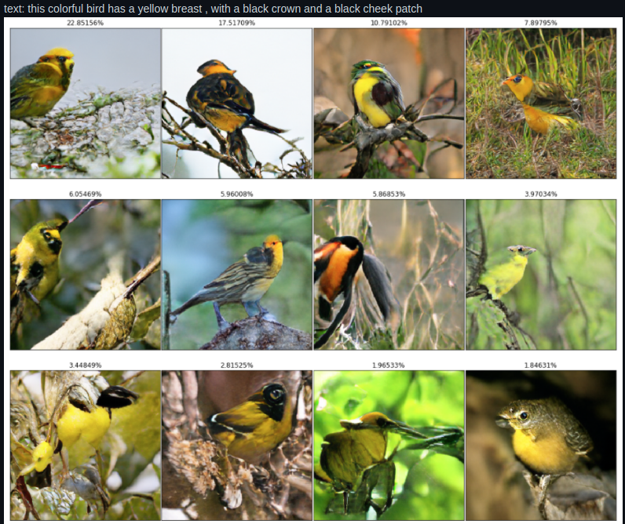
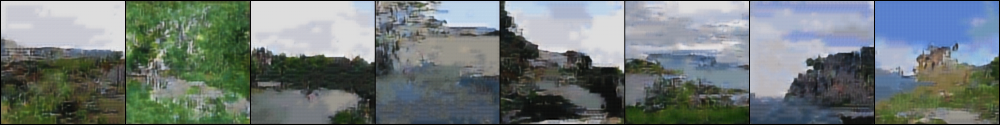
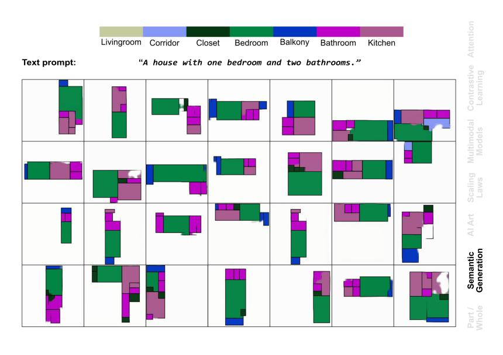
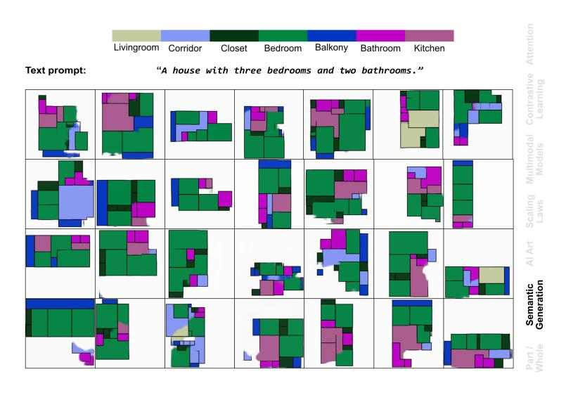
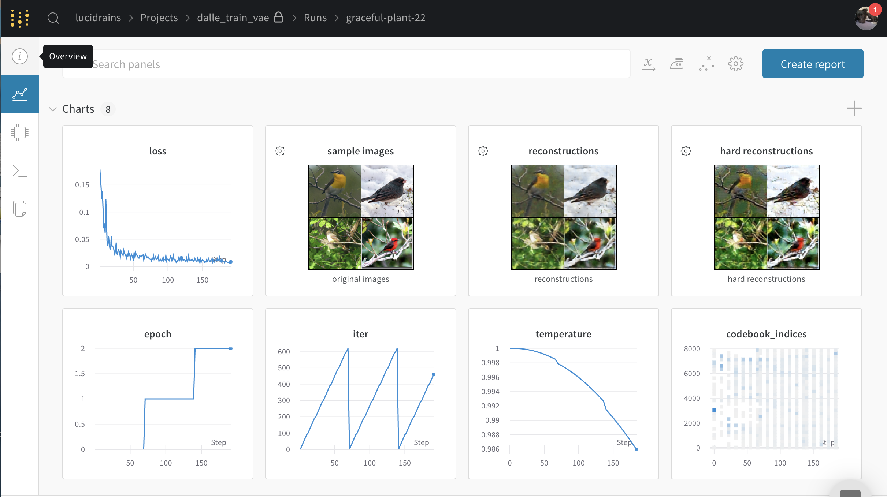

</img>

** current best, trained by <a href="https://github.com/kobiso">Kobiso</a> **

## DALL-E in Pytorch

Implementation / replication of <a href="https://openai.com/blog/dall-e/">DALL-E</a> (<a href="https://arxiv.org/abs/2102.12092">paper</a>), OpenAI's Text to Image Transformer, in Pytorch. It will also contain <a href="https://openai.com/blog/clip/">CLIP</a> for ranking the generations.

<a href="https://github.com/sdtblck">Sid</a>, <a href="http://github.com/kingoflolz">Ben</a>, and <a href="https://github.com/AranKomat">Aran</a> over at <a href="https://www.eleuther.ai/">Eleuther AI</a> are working on <a href="https://github.com/EleutherAI/DALLE-mtf">DALL-E for Mesh Tensorflow</a>! Please lend them a hand if you would like to see DALL-E trained on TPUs.

<a href="https://www.youtube.com/watch?v=j4xgkjWlfL4">Yannic Kilcher's video</a>

Before we replicate this, we can settle for <a href="https://github.com/lucidrains/deep-daze">Deep Daze</a> or <a href="https://github.com/lucidrains/big-sleep">Big Sleep</a>

[](https://colab.research.google.com/drive/1dWvA54k4fH8zAmiix3VXbg95uEIMfqQM?usp=sharing) Train in Colab

## Status

- <a href="https://github.com/htoyryla">Hannu</a> has managed to train a small 6 layer DALL-E on a dataset of just 2000 landscape images! (2048 visual tokens)

</img>

- <a href="https://github.com/kobiso">Kobiso</a>, a research engineer from Naver, has trained on the CUB200 dataset <a href="https://github.com/lucidrains/DALLE-pytorch/discussions/131">here</a>, using full and deepspeed sparse attention
- <a href="https://github.com/afiaka87">afiaka87</a> has managed one epoch using a 32 layer reversible DALL-E <a href="https://github.com/lucidrains/DALLE-pytorch/issues/86#issue-832121328">here</a>
- <a href="https://github.com/robvanvolt">robvanvolt</a> has started a <a href="https://discord.gg/gVuU2YE5hd">Discord channel</a> for replication efforts

- <a href="https://github.com/robvanvolt">TheodoreGalanos</a> has trained on 150k layouts with the following results

</img>

</img>

## Install

```bash
$ pip install dalle-pytorch
```

## Usage

Train VAE

```python
import torch
from dalle_pytorch import DiscreteVAE

vae = DiscreteVAE(
    image_size = 256,
    num_layers = 3,           # number of downsamples - ex. 256 / (2 ** 3) = (32 x 32 feature map)
    num_tokens = 8192,        # number of visual tokens. in the paper, they used 8192, but could be smaller for downsized projects
    codebook_dim = 512,       # codebook dimension
    hidden_dim = 64,          # hidden dimension
    num_resnet_blocks = 1,    # number of resnet blocks
    temperature = 0.9,        # gumbel softmax temperature, the lower this is, the harder the discretization
    straight_through = False, # straight-through for gumbel softmax. unclear if it is better one way or the other
)

images = torch.randn(4, 3, 256, 256)

loss = vae(images, return_loss = True)
loss.backward()

# train with a lot of data to learn a good codebook
```

Train DALL-E with pretrained VAE from above

```python
import torch
from dalle_pytorch import DiscreteVAE, DALLE

vae = DiscreteVAE(
    image_size = 256,
    num_layers = 3,
    num_tokens = 8192,
    codebook_dim = 1024,
    hidden_dim = 64,
    num_resnet_blocks = 1,
    temperature = 0.9
)

dalle = DALLE(
    dim = 1024,
    vae = vae,                  # automatically infer (1) image sequence length and (2) number of image tokens
    num_text_tokens = 10000,    # vocab size for text
    text_seq_len = 256,         # text sequence length
    depth = 12,                 # should aim to be 64
    heads = 16,                 # attention heads
    dim_head = 64,              # attention head dimension
    attn_dropout = 0.1,         # attention dropout
    ff_dropout = 0.1            # feedforward dropout
)

text = torch.randint(0, 10000, (4, 256))
images = torch.randn(4, 3, 256, 256)
mask = torch.ones_like(text).bool()

loss = dalle(text, images, mask = mask, return_loss = True)
loss.backward()

# do the above for a long time with a lot of data ... then

images = dalle.generate_images(text, mask = mask)
images.shape # (4, 3, 256, 256)
```

To prime with a starting crop of an image, simply pass two more arguments

```python
img_prime = torch.randn(4, 3, 256, 256)

images = dalle.generate_images(
    text,
    mask = mask,
    img = img_prime,
    num_init_img_tokens = (14 * 32)  # you can set the size of the initial crop, defaults to a little less than ~1/2 of the tokens, as done in the paper
)

images.shape # (4, 3, 256, 256)
```

## OpenAI's Pretrained VAE

You can also skip the training of the VAE altogether, using the pretrained model released by OpenAI! The wrapper class should take care of downloading and caching the model for you auto-magically.

```python
import torch
from dalle_pytorch import OpenAIDiscreteVAE, DALLE

vae = OpenAIDiscreteVAE()       # loads pretrained OpenAI VAE

dalle = DALLE(
    dim = 1024,
    vae = vae,                  # automatically infer (1) image sequence length and (2) number of image tokens
    num_text_tokens = 10000,    # vocab size for text
    text_seq_len = 256,         # text sequence length
    depth = 1,                  # should aim to be 64
    heads = 16,                 # attention heads
    dim_head = 64,              # attention head dimension
    attn_dropout = 0.1,         # attention dropout
    ff_dropout = 0.1            # feedforward dropout
)

text = torch.randint(0, 10000, (4, 256))
images = torch.randn(4, 3, 256, 256)
mask = torch.ones_like(text).bool()

loss = dalle(text, images, mask = mask, return_loss = True)
loss.backward()
```

## Taming Transformer's Pretrained VQGAN VAE

You can also use the pretrained VAE offered by the authors of <a href="https://github.com/CompVis/taming-transformers">Taming Transformers</a>! Currently only the VAE with a codebook size of 1024 is offered, with the hope that it may train a little faster than OpenAI's, which has a size of 8192.

In contrast to OpenAI's VAE, it also has an extra layer of downsampling, so the image sequence length is 256 instead of 1024 (this will lead to a 16 reduction in training costs, when you do the math). Whether it will generalize as well as the original DALL-E is up to the citizen scientists out there to discover.

Update - <a href="https://github.com/lucidrains/DALLE-pytorch/discussions/131">it works!</a>

```python
from dalle_pytorch import VQGanVAE1024

vae = VQGanVAE1024()

# the rest is the same as the above example
```

## Ranking the generations

Train CLIP

```python
import torch
from dalle_pytorch import CLIP

clip = CLIP(
    dim_text = 512,
    dim_image = 512,
    dim_latent = 512,
    num_text_tokens = 10000,
    text_enc_depth = 6,
    text_seq_len = 256,
    text_heads = 8,
    num_visual_tokens = 512,
    visual_enc_depth = 6,
    visual_image_size = 256,
    visual_patch_size = 32,
    visual_heads = 8
)

text = torch.randint(0, 10000, (4, 256))
images = torch.randn(4, 3, 256, 256)
mask = torch.ones_like(text).bool()

loss = clip(text, images, text_mask = mask, return_loss = True)
loss.backward()
```

To get the similarity scores from your trained Clipper, just do

```python
images, scores = dalle.generate_images(text, mask = mask, clip = clip)

scores.shape # (2,)
images.shape # (2, 3, 256, 256)

# do your topk here, in paper they sampled 512 and chose top 32
```

Or you can just use the official <a href="https://github.com/openai/CLIP">CLIP model</a> to rank the images from DALL-E

## Scaling depth

In the blog post, they used 64 layers to achieve their results. I added reversible networks, from the <a href="https://github.com/lucidrains/reformer-pytorch">Reformer</a> paper, in order for users to attempt to scale depth at the cost of compute. Reversible networks allow you to scale to any depth at no memory cost, but a little over 2x compute cost (each layer is rerun on the backward pass).

Simply set the `reversible` keyword to `True` for the `DALLE` class

```python
dalle = DALLE(
    dim = 1024,
    vae = vae,
    num_text_tokens = 10000,
    text_seq_len = 256,
    depth = 64,
    heads = 16,
    reversible = True  # <-- reversible networks https://arxiv.org/abs/2001.04451
)
```

## Sparse Attention

The blogpost alluded to a mixture of different types of sparse attention, used mainly on the image (while the text presumably had full causal attention). I have done my best to replicate these types of sparse attention, on the scant details released. Primarily, it seems as though they are doing causal axial row / column attention, combined with a causal convolution-like attention.

By default `DALLE` will use full attention for all layers, but you can specify the attention type per layer as follows.

- `full` full attention

- `axial_row` axial attention, along the rows of the image feature map

- `axial_col` axial attention, along the columns of the image feature map

- `conv_like` convolution-like attention, for the image feature map

The sparse attention only applies to the image. Text will always receive full attention, as said in the blogpost.

```python
dalle = DALLE(
    dim = 1024,
    vae = vae,
    num_text_tokens = 10000,
    text_seq_len = 256,
    depth = 64,
    heads = 16,
    reversible = True,
    attn_types = ('full', 'axial_row', 'axial_col', 'conv_like')  # cycles between these four types of attention
)
```

## Deepspeed Sparse Attention

You can also train with Microsoft Deepspeed's <a href="https://www.deepspeed.ai/news/2020/09/08/sparse-attention.html">Sparse Attention</a>, with any combination of dense and sparse attention that you'd like. However, you will have to endure the installation process.

First, you need to install Deepspeed with Sparse Attention

```bash
$ sh install_deepspeed.sh
```

Next, you need to install the pip package `triton`

```bash
$ pip install triton
```

If both of the above succeeded, now you can train with Sparse Attention!

```python
dalle = DALLE(
    dim = 512,
    vae = vae,
    num_text_tokens = 10000,
    text_seq_len = 256,
    depth = 64,
    heads = 8,
    attn_types = ('full', 'sparse')  # interleave sparse and dense attention for 64 layers
)
```

## Training

This section will outline how to train the discrete variational autoencoder as well as the final multi-modal transformer (DALL-E). We are going to use <a href="https://wandb.ai/">Weights & Biases</a> for all the experiment tracking.

(You can also do everything in this section in a Google Colab, link below)

[](https://colab.research.google.com/drive/1dWvA54k4fH8zAmiix3VXbg95uEIMfqQM?usp=sharing) Train in Colab

```bash
$ pip install wandb
```

Followed by

```bash
$ wandb login
```

### VAE

To train the VAE, you just need to run

```python
$ python train_vae.py --image_folder /path/to/your/images
```

If you installed everything correctly, a link to the experiments page should show up in your terminal. You can follow your link there and customize your experiment, like the example layout below.

</img>

You can of course open up the training script at `./train_vae.py`, where you can modify the constants, what is passed to Weights & Biases, or any other tricks you know to make the VAE learn better.

Model will be saved periodically to `./vae.pt`

In the experiment tracker, you will have to monitor the hard reconstruction, as we are essentially teaching the network to compress images into discrete visual tokens for use in the transformer as a visual vocabulary.

Weights and Biases will allow you to monitor the temperature annealing, image reconstructions (encoder and decoder working properly), as well as to watch out for codebook collapse (where the network decides to only use a few tokens out of what you provide it).

Once you have trained a decent VAE to your satisfaction, you can move on to the next step with your model weights at `./vae.pt`.

### DALL-E

Now you just have to invoke the `./train_dalle.py` script, indicating which VAE model you would like to use, as well as the path to your folder if images and text.

The dataset I am currently working with contains a folder of images and text files, arbitraily nested in subfolders, where text file name corresponds with the image name, and where each text file contains multiple descriptions, delimited by newlines. The script will find and pair all the image and text files with the same names, and randomly select one of the textual descriptions during batch creation.

ex.

```
📂image-and-text-data
 ┣ 📜cat.png
 ┣ 📜cat.txt
 ┣ 📜dog.jpg
 ┣ 📜dog.txt
 ┣ 📜turtle.jpeg
 ┗ 📜turtle.txt
```

ex. `cat.txt`

```text
A black and white cat curled up next to the fireplace
A fireplace, with a cat sleeping next to it
A black cat with a red collar napping
```

If you have a dataset with its own directory structure for tying together image and text descriptions, do let me know in the issues, and I'll see if I can accommodate it in the script.

```python
$ python train_dalle.py --vae_path ./vae.pt --image_text_folder /path/to/data
```

You likely will not finish DALL-E training as quickly as you did your Discrete VAE. To resume from where you left off, just run the same script, but with the path to your DALL-E checkpoints.

```python
$ python train_dalle.py --dalle_path ./dalle.pt --image_text_folder /path/to/data
```

### DALL-E with OpenAI's VAE

You can now also train DALL-E without having to train the Discrete VAE at all, courtesy to their open-sourcing their model. You simply have to invoke the `train_dalle.py` script without specifying the `--vae_path`

```python
$ python train_dalle.py --image_text_folder /path/to/coco/dataset
```

### Generation

Once you have successfully trained DALL-E, you can then use the saved model for generation!

```python
$ python generate.py --dalle_path ./dalle.pt --text 'fireflies in a field under a full moon'
```

You should see your images saved as `./outputs/{your prompt}/{image number}.jpg`

To generate multiple images, just pass in your text with '|' character as a separator.

ex.

```python
$ python generate.py --dalle_path ./dalle.pt --text 'a dog chewing a bone|a cat chasing mice|a frog eating a fly'
```

### Distributed Training

#### DeepSpeed

Thanks to <a href="https://github.com/janEbert">janEbert</a>, the repository is now equipped so you can train DALL-E with Microsoft's <a href="https://www.deepspeed.ai/">Deepspeed</a>!

You can simply replace any `$ python <file>.py [args...]` command with

```sh
$ deepspeed <file>.py [args...] --deepspeed
```

to use the aforementioned DeepSpeed library for distributed training, speeding up your experiments.

Modify the `deepspeed_config` dictionary in `train_dalle.py` or
`train_vae.py` according to the DeepSpeed settings you'd like to use
for each one. See the [DeepSpeed configuration
docs](https://www.deepspeed.ai/docs/config-json/) for more
information.

Note that for ZeRO optimizations, it's currently required to pass the
`--fp16` flag as well to activate half-precision training. This is
only supported for `train_dalle.py`.

#### Horovod

[Horovod](https://horovod.ai) offers a stable way for data parallel
training.

After [installing
Horovod](https://github.com/lucidrains/DALLE-pytorch/wiki/Horovod-Installation),
replace any `$ python <file>.py [args...]` command with

```sh
$ horovodrun -np <num-gpus> <file>.py [args...] --distributed_backend horovod
```

to use the Horovod library for distributed training, speeding up your
experiments. This will multiply your effective batch size per training
step by `<num-gpus>`, so you may need to rescale the learning rate
accordingly.

#### Custom Tokenizer

This repository supports custom tokenization with <a href="https://github.com/VKCOM/YouTokenToMe">YouTokenToMe</a>, if you wish to use it instead of the default simple tokenizer. Simply pass in an extra `--bpe_path` when invoking `train_dalle.py` and `generate.py`, with the path to your BPE model file.

The only requirement is that you use `0` as the padding during tokenization

ex.

```sh
$ python train_dalle.py --image_text_folder ./path/to/data --bpe_path ./path/to/bpe.model
```

To create a BPE model file from scratch, firstly

```bash
$ pip install youtokentome
```

Then you need to prepare a big text file that is a representative sample of the type of text you want to encode. You can then invoke the `youtokentome` command-line tools. You'll also need to specify the vocab size you wish to use, in addition to the corpus of text.

```bash
$ yttm bpe --vocab_size 8000 --data ./path/to/big/text/file.txt --model ./path/to/bpe.model
```

That's it! The BPE model file is now saved to `./path/to/bpe.model` and you can begin training!

#### Chinese

You can train with a <a href="https://huggingface.co/bert-base-chinese">pretrained chinese tokenizer</a> offered by Huggingface 🤗 by simply passing in an extra flag `--chinese`

ex.

```sh
$ python train_dalle.py --chinese --image_text_folder ./path/to/data
```

```sh
$ python generate.py --chinese --text '追老鼠的猫'
```

## Citations

```bibtex
@misc{ramesh2021zeroshot,
    title   = {Zero-Shot Text-to-Image Generation}, 
    author  = {Aditya Ramesh and Mikhail Pavlov and Gabriel Goh and Scott Gray and Chelsea Voss and Alec Radford and Mark Chen and Ilya Sutskever},
    year    = {2021},
    eprint  = {2102.12092},
    archivePrefix = {arXiv},
    primaryClass = {cs.CV}
}
```

```bibtex
@misc{unpublished2021clip,
    title  = {CLIP: Connecting Text and Images},
    author = {Alec Radford, Ilya Sutskever, Jong Wook Kim, Gretchen Krueger, Sandhini Agarwal},
    year   = {2021}
}
```

```bibtex
@misc{kitaev2020reformer,
    title   = {Reformer: The Efficient Transformer},
    author  = {Nikita Kitaev and Łukasz Kaiser and Anselm Levskaya},
    year    = {2020},
    eprint  = {2001.04451},
    archivePrefix = {arXiv},
    primaryClass = {cs.LG}
}
```

```bibtex
@misc{esser2021taming,
    title   = {Taming Transformers for High-Resolution Image Synthesis},
    author  = {Patrick Esser and Robin Rombach and Björn Ommer},
    year    = {2021},
    eprint  = {2012.09841},
    archivePrefix = {arXiv},
    primaryClass = {cs.CV}
}
```

*Those who do not want to imitate anything, produce nothing.* - Dali
